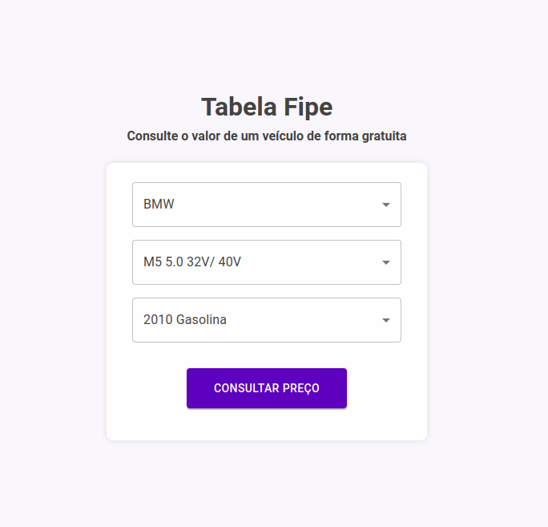

# Fipe

[Demo](https://fipe-nextjs-ui.vercel.app/)



## Getting Started

First, install dependencies:

```bash
yarn
```

Run the development server:

```bash
yarn dev
```

Open [http://localhost:3000](http://localhost:3000) with your browser to see the result.

Test with

```bash
yarn test
```

## Development Features

- NextJS
- React
- eslint
- lint-staged
- husky
- typescript
- editorconfig
- prettier
- SSR to styled-components
- Context API
- Material UI
- Theming
- axios-mock-adapter
